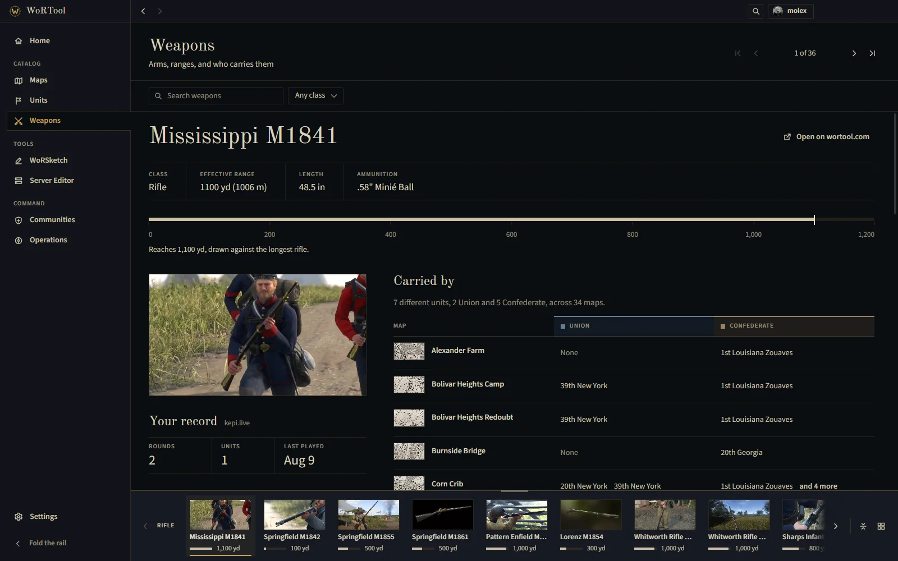
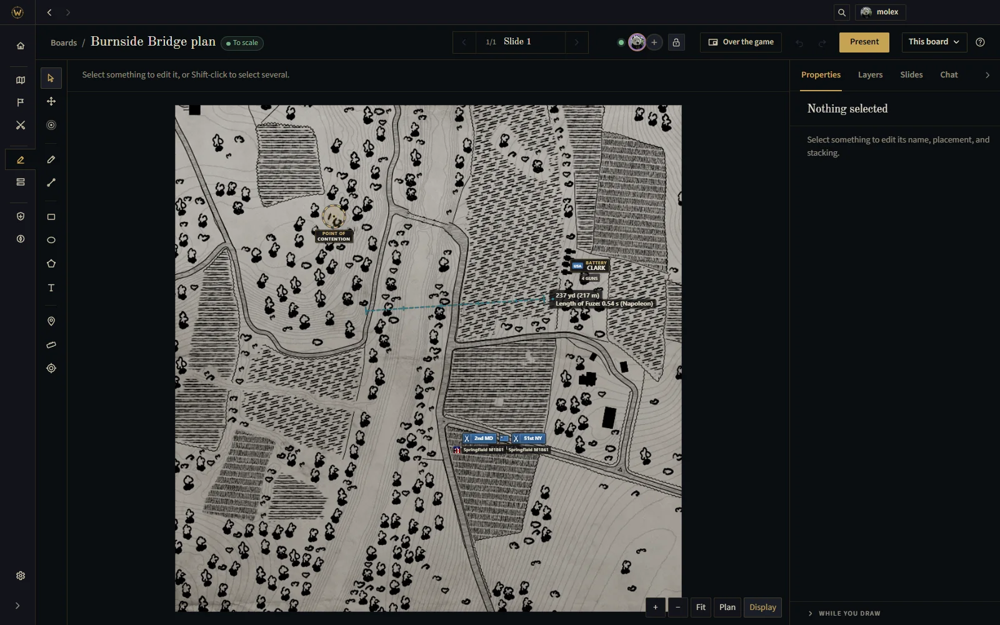

<div align="center">

<picture>
  <source media="(prefers-color-scheme: dark)" srcset="https://raw.githubusercontent.com/molexxxx/wortool-desktop/main/.github/assets/logo-dark.svg">
  <source media="(prefers-color-scheme: light)" srcset="https://raw.githubusercontent.com/molexxxx/wortool-desktop/main/.github/assets/logo-light.svg">
  
</picture>

<br/>

**The War of Rights catalog, planner and unit tools from [wortool.com](https://wortool.com), in a window beside the game.**

<a href="https://github.com/molexxxx/wortool-desktop/releases/latest"></a>
<a href="https://github.com/molexxxx/wortool-desktop/actions/workflows/release.yml"></a>
<a href="https://github.com/molexxxx/wortool-desktop/releases"></a>
<a href="LICENSE"></a>
<a href="https://github.com/molexxxx/wortool-desktop/commits/main"></a>

<br/>

[Download](#download) &middot; [What's in it](#whats-in-it) &middot; [Updates](#updates) &middot; [FAQ](#faq) &middot; [Report a problem](https://github.com/molexxxx/wortool-desktop/issues/new) &middot; [wortool.com](https://wortool.com)

<br/>


<table>
  <tr>
    <td align="center"><a href=".github/assets/screens/units.webp"><br/><sub>Units</sub></a></td>
    <td align="center"><a href=".github/assets/screens/weapons.webp"><br/><sub>Weapons</sub></a></td>
    <td align="center"><a href=".github/assets/screens/board.webp"><br/><sub>WoRSketch</sub></a></td>
  </tr>
</table>

</div>

## Download

Every build is on the [releases page](https://github.com/molexxxx/wortool-desktop/releases/latest). Pick the file for your system:

| System | File |
| --- | --- |
| Windows 10 and 11, 64-bit | `wortool-<version>-Windows-Setup.exe` |
| macOS, Apple silicon and Intel | `wortool-<version>-macOS-Installer.dmg` |
| Linux, any distribution | `wortool-<version>-Linux.AppImage` |
| Debian, Ubuntu and derivatives | `wortool-<version>-Linux.deb` |
| Fedora, openSUSE and derivatives | `wortool-<version>-Linux.rpm` |

**Windows.** Run the installer. SmartScreen may say it does not recognize the app, because the installer is not signed with a code signing certificate yet; choose More info, then Run anyway. The installer asks where to install and adds Start menu and desktop shortcuts.

**macOS.** Open the dmg and drag WoRTool into Applications. The app is signed and notarized by Apple, so it opens without a warning.

**Linux.** Mark the AppImage executable and run it, or install the package for your distribution:

```sh
chmod +x wortool-*-Linux.AppImage && ./wortool-*-Linux.AppImage

sudo apt install ./wortool-*-Linux.deb
sudo dnf install ./wortool-*-Linux.rpm
```

## What's in it

<table>
  <tr>
    <td width="64" valign="top"></td>
    <td><b>The catalog, offline.</b> Every map, combat unit and weapon, with orders of battle, loadouts and effective ranges. The whole catalog is stored on your computer, and pages you have opened keep working without a connection.</td>
  </tr>
  <tr>
    <td width="64" valign="top"></td>
    <td><b>WoRSketch.</b> Plan an attack on the game's own maps with your unit: markers, lines, ranges and slides, drawn together live and kept in folders.</td>
  </tr>
  <tr>
    <td width="64" valign="top"></td>
    <td><b>A plan over the game.</b> Pin a plan in a see-through window on top of War of Rights, then show, hide, zoom and pan it with <kbd>Ctrl</kbd>+<kbd>Alt</kbd> shortcuts without leaving the game.</td>
  </tr>
  <tr>
    <td width="64" valign="top"></td>
    <td><b>Server editor.</b> Edit a dedicated server's configuration, admin list, logs and crash dumps over FTP. A unit's registered servers keep a history of every change, so a bad edit can be put back.</td>
  </tr>
  <tr>
    <td width="64" valign="top"></td>
    <td><b>Your units and operations.</b> Your unit's week, roster and ranks, and the operations it takes part in, as wortool.com shows them to you.</td>
  </tr>
  <tr>
    <td width="64" valign="top"></td>
    <td><b>Notifications and the tray.</b> Events, applications and activity arrive as system notifications, and the tray icon keeps count while the window is closed.</td>
  </tr>
  <tr>
    <td width="64" valign="top"></td>
    <td><b>Quiet updates.</b> New versions download in the background. The app says when one is ready and restarts into it when you choose.</td>
  </tr>
  <tr>
    <td width="64" valign="top"></td>
    <td><b>Open in the app.</b> <code>wortool://</code> links from the site and from Discord open the matching page here, and once the app has signed in from your browser, pages on wortool.com offer to open in it.</td>
  </tr>
</table>

Press <kbd>Ctrl</kbd>+<kbd>K</kbd> (<kbd>Cmd</kbd>+<kbd>K</kbd> on macOS) anywhere to jump to a page or one of your plans.

## Updates

The app checks this repository's releases a little after it starts and every few hours after that. A new version downloads in the background; when it is ready, a notice offers **Restart now**, and if you close it the update installs the next time you quit. Settings shows the version you have and can check straight away.

Each release lists what changed in the [release notes](https://github.com/molexxxx/wortool-desktop/releases). Versions stay below 1.0 while the app settles.

## FAQ

**Do I need a wortool.com account?**
The catalog works without one. Planning, your units and notifications need you signed in. The app signs in through your browser with the account you already use on wortool.com, so nothing you type there passes through the app.

**Is my password stored?**
No. Sign-in happens on wortool.com. The app receives a session of its own, kept encrypted by your system's keystore; on a Linux desktop without a keyring, the session lasts until the app closes.

**Why does Windows warn me about the installer?**
The Windows build is not signed with a code signing certificate yet, so SmartScreen does not know it. Choose More info, then Run anyway. The macOS build is signed and notarized.

**The plan does not show over the game.**
A game in exclusive fullscreen draws over every other window. Switch War of Rights to windowed or borderless windowed mode.

**Where does the app keep its data?**
Settings, the stored catalog and your session live in `%APPDATA%\WoRTool` on Windows, `~/Library/Application Support/WoRTool` on macOS and `~/.config/WoRTool` on Linux.

**How do I uninstall it?**
On Windows, from Settings, Apps. On macOS, drag WoRTool from Applications to the Trash. On Linux, delete the AppImage, or run `sudo apt remove wortool-desktop` or `sudo dnf remove wortool-desktop`.

**Is the source code here?**
No. The app is built from the wortool.com source, which is private. This repository holds the workflow that builds and signs the installers, and the releases the app updates from.

**Something is wrong, or I would like something added.**
Open an [issue](https://github.com/molexxxx/wortool-desktop/issues/new) with what you did, what you expected and what happened instead; your operating system and the version from Settings help. Account, unit and privacy questions go through [wortool.com/contact](https://wortool.com/contact).

## License

[MIT](LICENSE)
