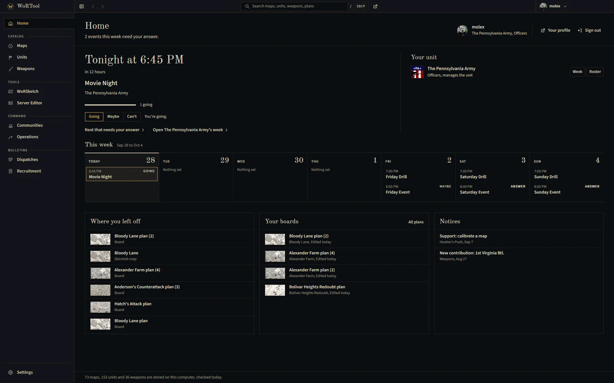
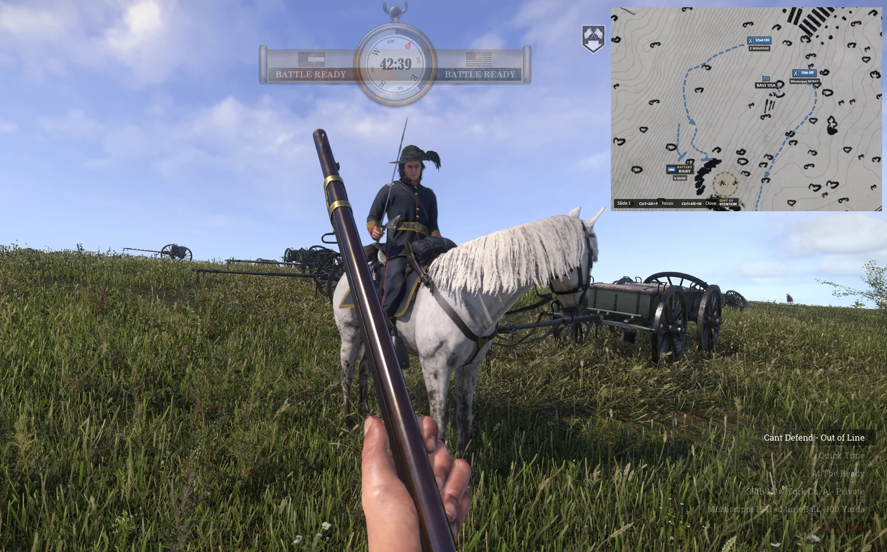
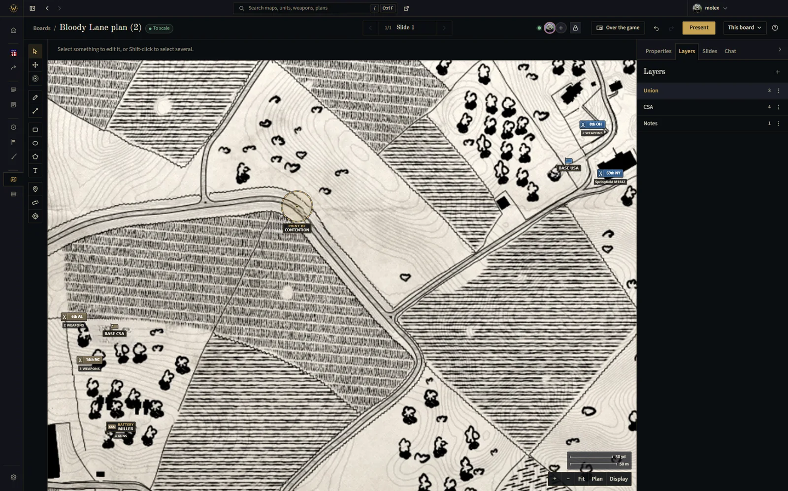
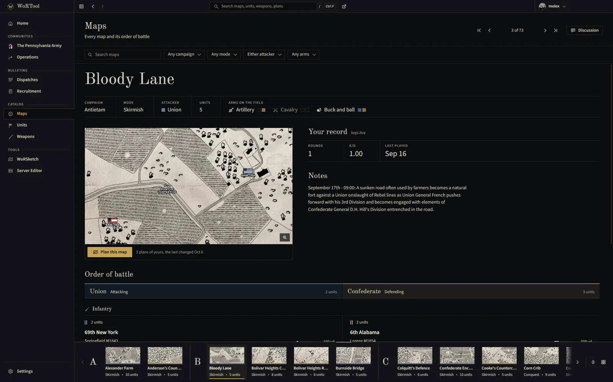
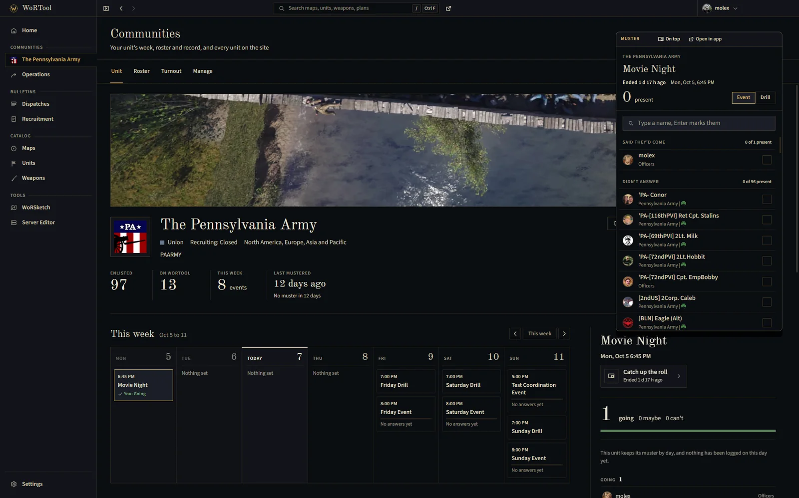
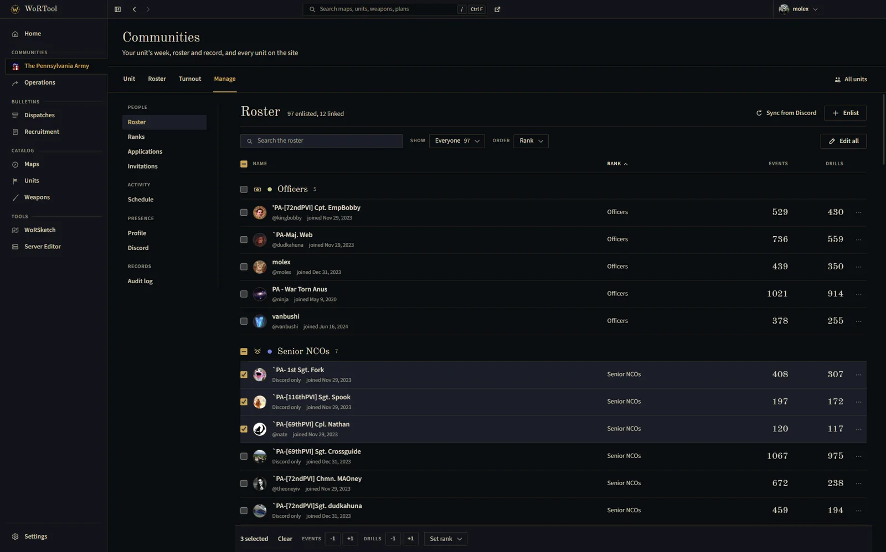
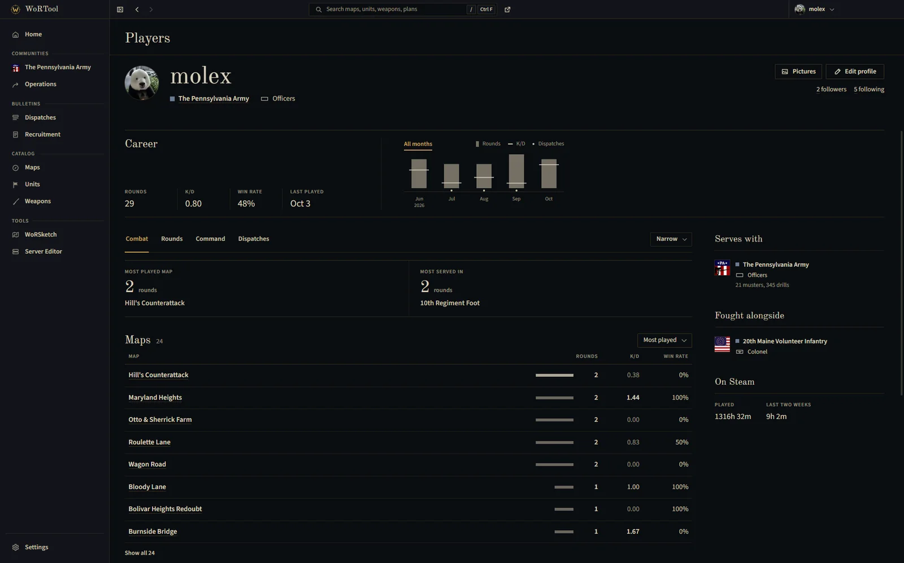
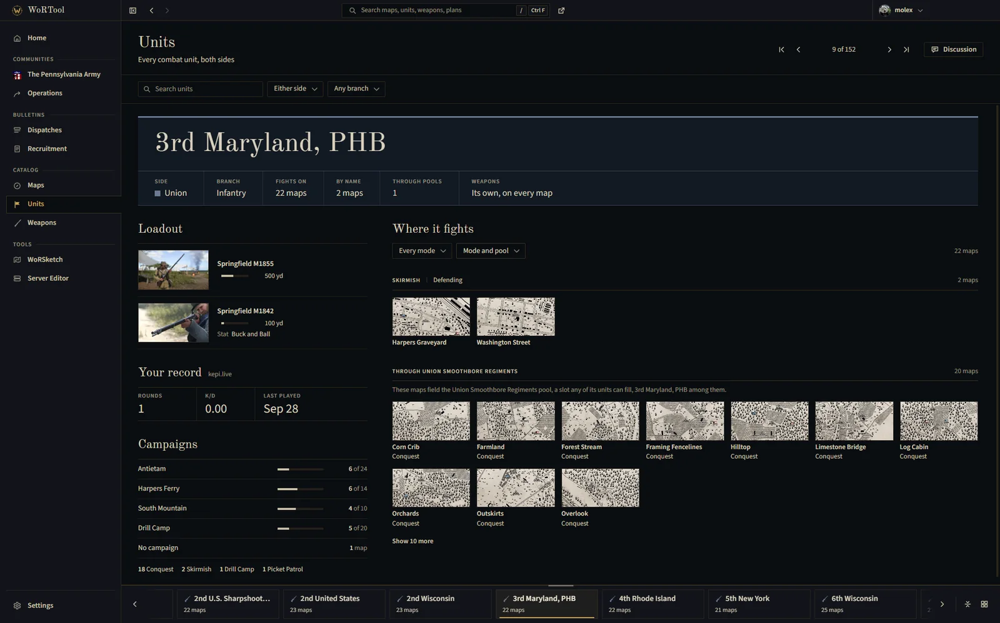
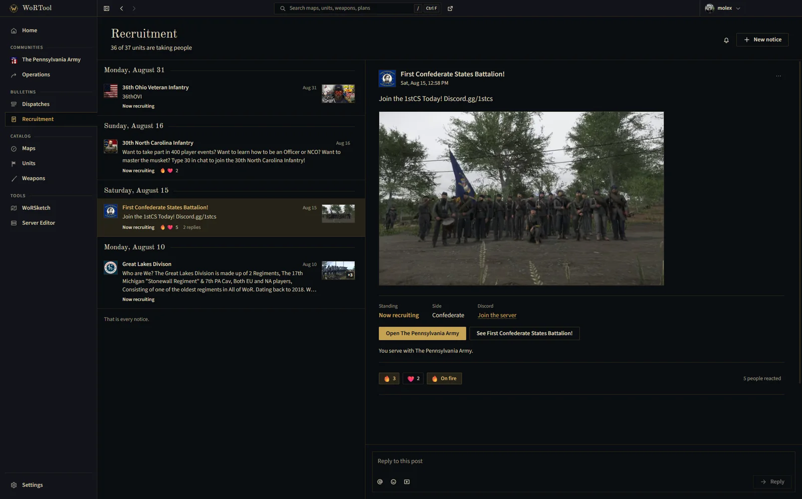
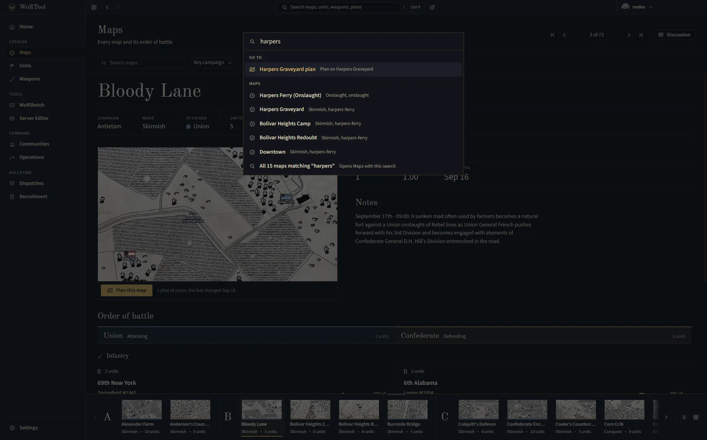

<div align="center">

<picture>
  <source media="(prefers-color-scheme: dark)" srcset="https://raw.githubusercontent.com/molexxxx/wortool-desktop/main/.github/assets/logo-dark.svg">
  <source media="(prefers-color-scheme: light)" srcset="https://raw.githubusercontent.com/molexxxx/wortool-desktop/main/.github/assets/logo-light.svg">
  
</picture>

<br/>

**The War of Rights catalog, planner and unit tools from [wortool.com](https://wortool.com), in a window beside the game.**

<a href="https://github.com/molexxxx/wortool-desktop/releases/latest"></a>
<a href="https://github.com/molexxxx/wortool-desktop/actions/workflows/release.yml"></a>
<a href="https://github.com/molexxxx/wortool-desktop/releases"></a>
<a href="LICENSE"></a>
<a href="https://github.com/molexxxx/wortool-desktop/commits/main"></a>

<br/>

[Download](#download) &middot; [What's in it](#whats-in-it) &middot; [Updates](#updates) &middot; [FAQ](#faq) &middot; [Report a problem](https://github.com/molexxxx/wortool-desktop/issues/new) &middot; [wortool.com](https://wortool.com)

<br/>

<a href=".github/assets/screens/home.webp"></a>
<br/>
<sub>Home: your next event, your unit's week, your plans and your notices at a glance.</sub>

<br/>

<table>
  <tr>
    <td align="center" width="33%"><a href=".github/assets/screens/overlay.webp"></a><br/><sub><b>Over the game</b><br/>Your plan, live, above the fight</sub></td>
    <td align="center" width="33%"><a href=".github/assets/screens/worsketch.webp"></a><br/><sub><b>WoRSketch</b><br/>Plan with your unit, live</sub></td>
    <td align="center" width="33%"><a href=".github/assets/screens/maps.webp"></a><br/><sub><b>The catalog</b><br/>Every map, unit and weapon, offline</sub></td>
  </tr>
  <tr>
    <td align="center" width="33%"><a href=".github/assets/screens/muster.webp"></a><br/><sub><b>Muster</b><br/>Take the roll over the game</sub></td>
    <td align="center" width="33%"><a href=".github/assets/screens/manage.webp"></a><br/><sub><b>Run your unit</b><br/>Roster, ranks, schedule and more</sub></td>
    <td align="center" width="33%"><a href=".github/assets/screens/profile.webp"></a><br/><sub><b>Your record</b><br/>Every round you played</sub></td>
  </tr>
  <tr>
    <td align="center" width="33%"><a href=".github/assets/screens/units.webp"></a><br/><sub><b>Units</b><br/>Loadouts and where they fight</sub></td>
    <td align="center" width="33%"><a href=".github/assets/screens/recruitment.webp"></a><br/><sub><b>Recruitment</b><br/>Units looking for players</sub></td>
    <td align="center" width="33%"><a href=".github/assets/screens/search.webp"></a><br/><sub><b>Keyboard first</b><br/>Any page, a keystroke away</sub></td>
  </tr>
</table>

</div>

## Download

Every build is on the [releases page](https://github.com/molexxxx/wortool-desktop/releases/latest). Pick the file for your system:

| System | File |
| --- | --- |
| Windows 10 and 11, 64-bit | `wortool-<version>-Windows-Setup.exe` |
| macOS, Apple silicon and Intel | `wortool-<version>-macOS-Installer.dmg` |
| Linux, any distribution | `wortool-<version>-Linux.AppImage` |
| Debian, Ubuntu and derivatives | `wortool-<version>-Linux.deb` |
| Fedora, openSUSE and derivatives | `wortool-<version>-Linux.rpm` |

**Windows.** Run the installer. Windows may say it protected your PC: choose **More info**, then **Run anyway**. [Signing and verification](#signing-and-verification) explains why it asks. The installer asks where to install and adds Start menu and desktop shortcuts.

**macOS.** Open the dmg and drag WoRTool into Applications. The app is signed and notarized by Apple, so it opens without a warning.

**Linux.** Mark the AppImage executable and run it, or install the package for your distribution:

```sh
chmod +x wortool-*-Linux.AppImage && ./wortool-*-Linux.AppImage

sudo apt install ./wortool-*-Linux.deb
sudo dnf install ./wortool-*-Linux.rpm
```

## What's in it

<table>
  <tr>
    <td width="64" valign="top"></td>
    <td><b>The catalog, offline.</b> Every map, combat unit and weapon, with orders of battle, loadouts and effective ranges, and a conversation beside each one where you can @ players, units, maps and weapons. The whole catalog is stored on your computer, and pages you have opened keep working without a connection.</td>
  </tr>
  <tr>
    <td width="64" valign="top"></td>
    <td><b>WoRSketch.</b> Plan an attack on the game's own maps with your unit: markers, lines, ranges and slides, drawn together live in one room whether people joined from the app or a browser, and kept in folders.</td>
  </tr>
  <tr>
    <td width="64" valign="top"></td>
    <td><b>A plan over the game.</b> Pin a plan in a see-through window on top of War of Rights. It follows the plan live as your officers draw, and you show, hide, zoom and pan it with <kbd>Ctrl</kbd>+<kbd>Alt</kbd> shortcuts without leaving the game.</td>
  </tr>
  <tr>
    <td width="64" valign="top"></td>
    <td><b>Server editor.</b> Edit a dedicated server's configuration, admin list, logs and crash dumps over FTP. A unit's registered servers keep a history of every change, so a bad edit can be put back.</td>
  </tr>
  <tr>
    <td width="64" valign="top"></td>
    <td><b>Your units, dispatches and recruitment.</b> Your unit's week, roster, ranks and turnout reports, the operations it takes part in, dispatches, and the recruitment board, as wortool.com shows them to you. Officers keep the roster, ranks, schedule, applications, invitations and Discord settings from the app, and take the roll in a muster window that stays on top of the game.</td>
  </tr>
  <tr>
    <td width="64" valign="top"></td>
    <td><b>Notifications and the tray.</b> Events, applications and activity arrive as system notifications, and the tray icon keeps count while the window is closed.</td>
  </tr>
  <tr>
    <td width="64" valign="top"></td>
    <td><b>Quiet updates.</b> New versions download in the background. The app says when one is ready and restarts into it when you choose.</td>
  </tr>
  <tr>
    <td width="64" valign="top"></td>
    <td><b>Open in the app.</b> <code>wortool://</code> links from the site and from Discord open the matching page here, and once the app has signed in from your browser, pages on wortool.com offer to open in it.</td>
  </tr>
</table>

Press <kbd>Ctrl</kbd>+<kbd>F</kbd> (<kbd>Cmd</kbd>+<kbd>F</kbd> on macOS), or <kbd>/</kbd> anywhere outside a text field, to jump to a page or one of your plans.

## Updates

The app checks this repository's releases a little after it starts and every few hours after that. A new version downloads in the background; when it is ready, a notice offers **Restart now**, and if you close it the update installs the next time you quit. Settings shows the version you have and can check straight away.

Each release lists what changed in the [release notes](https://github.com/molexxxx/wortool-desktop/releases). Versions stay below 1.0 while the app settles.

## Signing and verification

Every installer is built from source by the [release workflow](.github/workflows/release.yml) in this repository, on GitHub's own runners, and every run's log is public under [Actions](https://github.com/molexxxx/wortool-desktop/actions/workflows/release.yml). Each system checks what it runs differently:

| | Windows | macOS | Linux |
| --- | --- | --- | --- |
| **Signature** | None. The NSIS installer carries no Authenticode certificate. | Developer ID Application certificate, with the hardened runtime on. | None. The AppImage, `.deb` and `.rpm` are not GPG-signed. |
| **First launch** | SmartScreen asks once: More info, then Run anyway. | Notarized by Apple; Gatekeeper reads the ticket stapled to the dmg, even offline. | Nothing to confirm. |
| **Updates** | Checked against the SHA-512 hash in the release's `latest.yml` before they install. | Installed only when signed by the same developer as the app already on your Mac. | The AppImage checks each update against the SHA-512 hash in `latest-linux.yml`. |

### Windows

Windows shows **Windows protected your PC** for any app it has not yet seen installed many times. Choose **More info**, then **Run anyway**. The prompt names an unknown publisher, which is what every unsigned installer shows. If your browser says the file is not commonly downloaded, choose **Keep**.

Signing is optional on Windows and paid for every year: about $10 a month for Microsoft's Artifact Signing service, or $150 to $300 a year for a certificate from a certificate authority, whose private key has to live on a hardware security module. It would not remove the prompt either: SmartScreen flags a newly signed app too, until enough people have installed it. Microsoft sets out the options and their costs in [Code signing options for Windows app developers](https://learn.microsoft.com/en-us/windows/apps/package-and-deploy/code-signing-options), and how the prompt decides in [SmartScreen reputation for Windows app developers](https://learn.microsoft.com/en-us/windows/apps/package-and-deploy/smartscreen-reputation).

On a PC with Smart App Control turned on, Windows blocks unsigned apps outright and offers no Run anyway.

### macOS

macOS only opens an app from the internet straight away when Apple can vouch for who made it. WoRTool is signed with a Developer ID Application certificate, which Apple issues to members of the [Apple Developer Program](https://developer.apple.com/programs/) ($99 a year), and built with the hardened runtime. Each release goes through Apple's notary service, which checks it for malicious code, and the ticket it issues is stapled to the dmg so Gatekeeper can confirm it offline. The updater installs only an update signed by the same developer.

To check it yourself after installing:

```sh
codesign --verify --deep --strict --verbose=2 /Applications/WoRTool.app
spctl --assess --type execute --verbose /Applications/WoRTool.app
```

The second command should end with `source=Notarized Developer ID`.

### Linux

Linux checks signatures on packages from your distribution's own repositories, not on an AppImage or a package you download yourself, so there is nothing to confirm when WoRTool first opens and nothing to buy.

## FAQ

**Do I need a wortool.com account?**
The catalog works without one. Planning, your units and notifications need you signed in. The app signs in through your browser with the account you already use on wortool.com, so nothing you type there passes through the app.

**Is my password stored?**
No. Sign-in happens on wortool.com. The app receives a session of its own, kept encrypted by your system's keystore; on a Linux desktop without a keyring, the session lasts until the app closes.

**Why does Windows warn me about the installer?**
The Windows installer is not signed, and SmartScreen asks about any app it has not yet seen installed many times. Choose More info, then Run anyway. [Signing and verification](#signing-and-verification) covers what signing would cost and why it would not remove the prompt. The macOS build is signed and notarized.

**The plan does not show over the game.**
A game in exclusive fullscreen draws over every other window. Switch War of Rights to windowed or borderless windowed mode.

**Where does the app keep its data?**
Settings, the stored catalog and your session live in `%APPDATA%\WoRTool` on Windows, `~/Library/Application Support/WoRTool` on macOS and `~/.config/WoRTool` on Linux.

**How do I uninstall it?**
On Windows, from Settings, Apps. On macOS, drag WoRTool from Applications to the Trash. On Linux, delete the AppImage, or run `sudo apt remove wortool-desktop` or `sudo dnf remove wortool-desktop`.

**Is the source code here?**
No. The app is built from the wortool.com source, which is private. This repository holds the workflow that builds every installer and signs and notarizes the macOS one, and the releases the app updates from.

**Something is wrong, or I would like something added.**
Open an [issue](https://github.com/molexxxx/wortool-desktop/issues/new) with what you did, what you expected and what happened instead; your operating system and the version from Settings help. Account, unit and privacy questions go through [wortool.com/contact](https://wortool.com/contact).

## License

[MIT](LICENSE)
